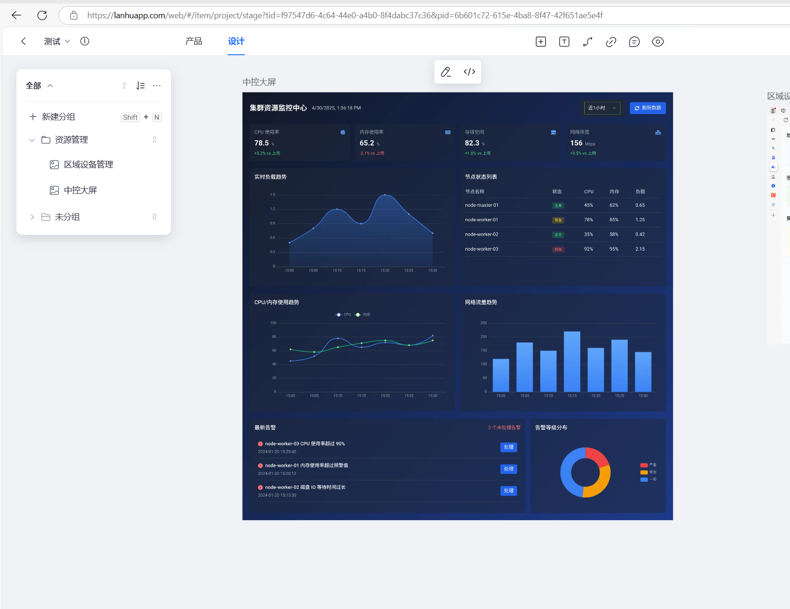
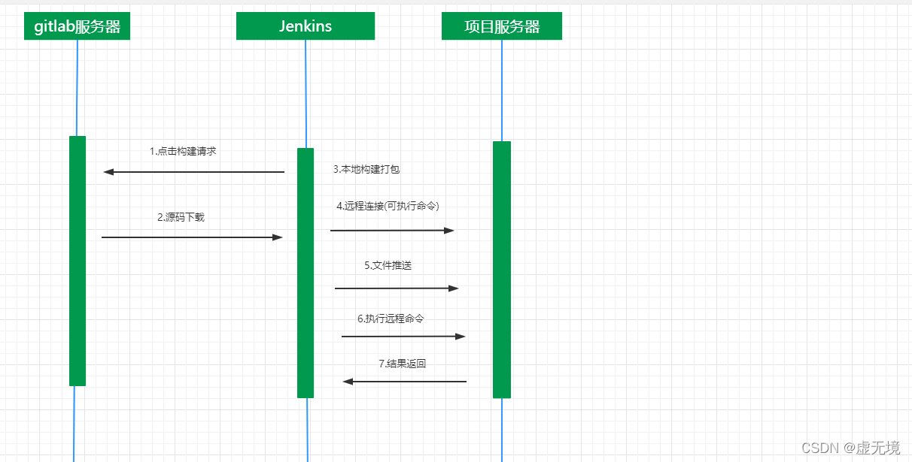
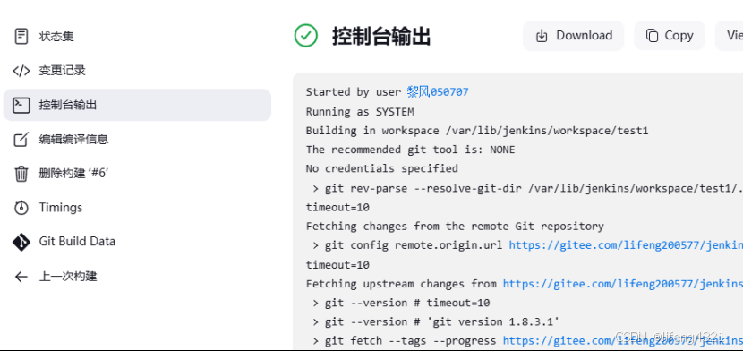
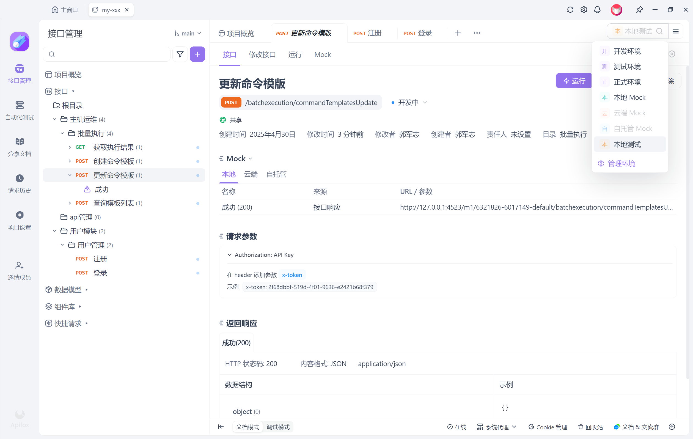
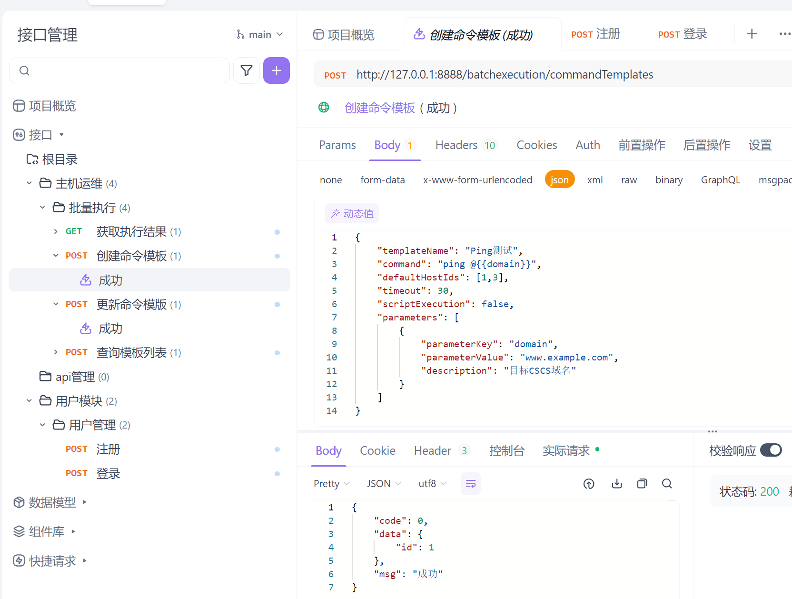
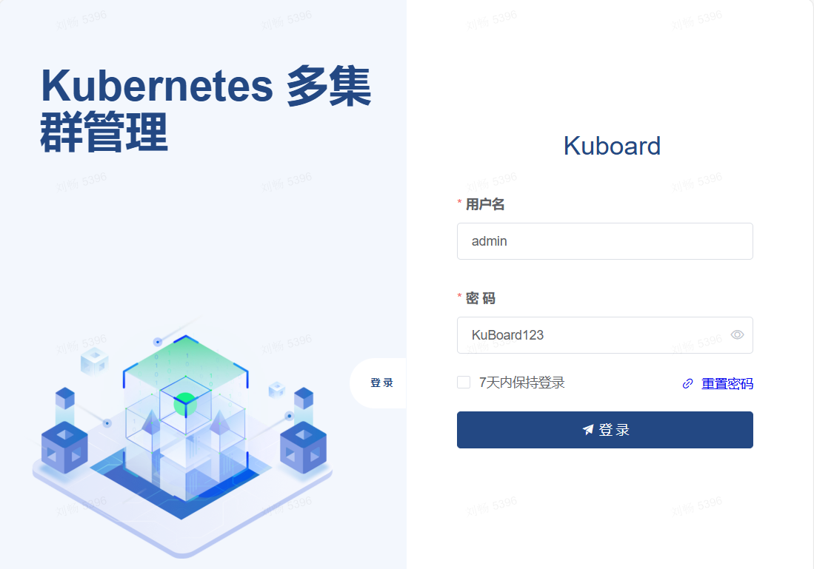
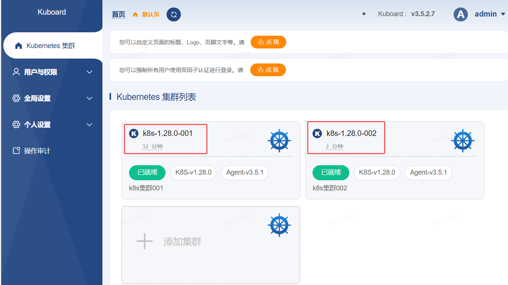
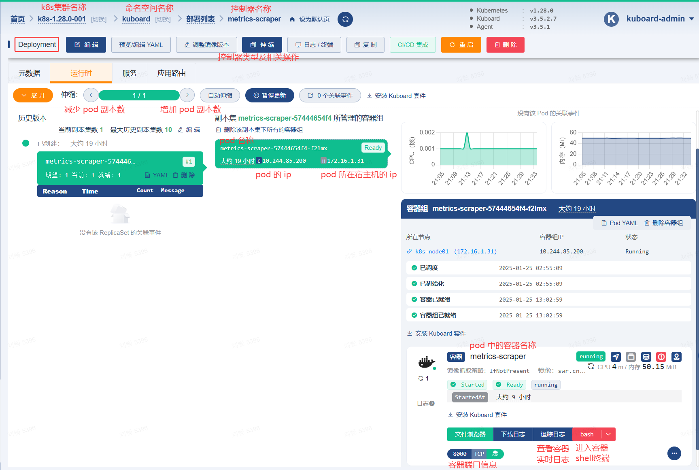

# 项目开发完整流水线

---

## 1. 需求收集与分析
**目标**：确保项目需求明确，团队成员对目标一致理解。

**步骤**：
1. **需求收集**：通过与客户、产品经理、业务分析师沟通，收集并整理需求。
2. **需求文档**：编写需求文档，定义功能和非功能需求。
3. **需求评审**：团队成员进行需求评审，确保没有遗漏。
4. **任务分配**：根据需求将任务分配给各个开发小组，使用项目管理工具进行任务跟踪。

**工具**：Notion, Jira, Trello, Confluence

---

## 2. 设计阶段
**目标**：根据需求设计系统架构和数据库结构。

**步骤**：
1. **系统架构设计**：定义系统模块、技术栈和系统架构（前后端分离、微服务等）。
2. **数据库设计**：设计数据库结构，确定表、字段及关系。
3. **API设计**：根据需求文档，使用工具设计和文档化API接口。
4. **技术选型**：根据项目需求选择适合的开发框架和技术栈。

**工具**：蓝湖，墨刀，MasterGo...
**以蓝湖为例**
在蓝湖中创建一个新的项目，并添加团队成员。

---

## 3. 开发阶段
**目标**：实现系统的各项功能，保持代码质量。

**步骤**：
1. **版本控制**：使用Git进行代码版本管理，创建合适的分支（主分支、开发分支、功能分支）。
2. **功能开发**：按照需求文档和设计文档实现功能模块。
3. **代码审查**：每个开发任务完成后，进行代码审查。
4. **单元测试**：编写单元测试，确保代码质量。

**工具**：Git, GitHub/GitLab/Bitbucket, IntelliJ IDEA, Visual Studio Code, ESLint (前端), JUnit (Java), PyTest (Python)

---

## 4. 持续集成与持续交付（CI/CD）
**目标**：实现代码自动化构建、测试和部署，保证软件质量。

**步骤**：
1. **自动化构建**：使用CI工具自动化构建项目。
2. **自动化测试**：在CI流程中集成单元测试、集成测试，确保代码质量。
3. **自动部署**：将通过测试的代码自动部署到开发、测试环境。
4. **构建报告**：CI系统生成构建报告，告知团队当前构建状态。

**工具**：Jenkins, GitHub Actions, GitLab CI, CircleCI, Travis CI ...
**以Jenkins为例**：
工作流程

构建输出日志

教程1（偏理论）
https://www.cnblogs.com/xuwujing/p/15725595.html
教程2（偏实际操作）
https://blog.csdn.net/lifeng4321/article/details/144682179
---

## 5. 接口管理与前后端对接
**目标**：确保前后端开发协同工作，接口规范清晰。

**步骤**：
1. **接口文档编写**：后端开发人员使用Apifox或Swagger编写API接口文档，确保接口的输入输出清晰。
2. **接口模拟**：前端开发使用接口模拟工具进行开发，确保在接口未完成时，前端也能进行开发。
3. **接口测试**：使用Postman进行接口测试，确保接口返回的数据符合预期。

**工具**：Apifox, Postman, Swagger, ApiPost
**以apifox为例**
开发界面

接口界面

---

## 6. 集成测试与回归测试
**目标**：验证各模块集成后的功能，确保没有引入新bug。

**步骤**：
1. **集成测试**：测试不同模块之间的接口是否正常。
2. **回归测试**：每次功能迭代后，进行回归测试，确保已完成的功能不被破坏。
3. **性能测试**：使用压力测试工具进行系统性能测试，确保在高负载下应用正常运行。

**工具**：Selenium, JUnit, Jest (前端)

---

## 7. 部署与上线
**目标**：确保代码可以顺利上线，并在生产环境稳定运行。

**步骤**：
1. **环境准备**：设置生产环境（云服务器、容器、数据库等）。
2. **自动化部署**：通过CI/CD工具自动将代码部署到生产环境。
3. **灰度发布**：逐步上线新功能，确保上线后没有问题。
4. **上线监控**：上线后对系统进行实时监控，确保系统稳定。

**工具**：Docker, Kubernetes, Jenkins, Nginx,
**以Kubernetes为例**：
使用网页部署：Kuboard
官网教程
https://kuboard.cn/learning/

---

## 8. 监控与日志管理
**目标**：确保生产环境的稳定性，及时发现并处理异常。

**步骤**：
1. **监控系统**：通过监控工具跟踪系统性能、流量等关键指标。
2. **日志管理**：收集应用日志、系统日志，帮助排查问题。
3. **告警设置**：设置关键指标的告警机制，及时响应异常情况。

**工具**：Prometheus, Grafana...

---

## 9. 版本发布与维护
**目标**：保证软件版本的稳定性和可扩展性，及时发布新版本。

**步骤**：
1. **版本管理**：定期发布新版本，管理不同版本的功能更新。
2. **Bug修复**：定期修复上线后发现的bug。
3. **文档更新**：确保技术文档和API文档同步更新。

**工具**：Git, GitHub/GitLab, Jira, Confluence

---

## 10. 项目总结与反馈
**目标**：总结项目经验教训，为下一个项目提供改进建议。

**步骤**：
1. **项目总结会议**：与团队成员召开项目总结会议，讨论项目中遇到的挑战和改进点。
2. **用户反馈**：根据用户反馈对系统进行优化和改进。

**工具**：Trello, Confluence, Jira

---

### 流程概览：

1. **需求收集与分析** → 2. **设计阶段** → 3. **开发阶段** → 4. **CI/CD流程** → 5. **接口管理与前后端对接** → 6. **集成与回归测试** → 7. **部署与上线** → 8. **监控与日志管理** → 9. **版本发布与维护** → 10. **项目总结与反馈**

---
(2025年4月30日 创建：郭军志)
